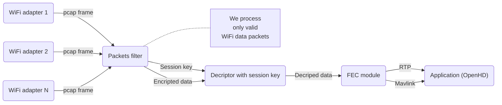

# Rx flow

Adapters in monitoring mode receives all packets.  
Current implementation uses only "Data Frame"`s.  
Session keys transferred as data without FEC and encryption.  
Encryption is done by libsodium

# Tx flow

# Frame format
